# 실시간 딥보이스/보이스피싱 탐지 및 예방 서비스 개발


# 1. Project Overview (프로젝트 개요)
> **보이스피싱**이란?<br>
> Voice Phishing = Voice + Private Data + Fishing

보이스피싱은 전기통신수단을 이용해 피해자를 속여 재산상의 이득을 취하는 범죄로 2006년 5월 국세청에 납부한 세금을 환수해 준다는 수법을 시작으로 오늘 날까지 꾸준히 발생하고 있는 사기 범죄이다.<br>
금전적인 피해뿐만 아니라 개인정보 유출로 인한 2차 피해까지 발생하고 있다.<br>
정부의 총력 대응으로 범죄가 감소하는 듯 했지만, 최근 수법과 기술이 변화하고 발전하며 다시금 피해가 급증하고 있다.<br>
<br>

<div>
  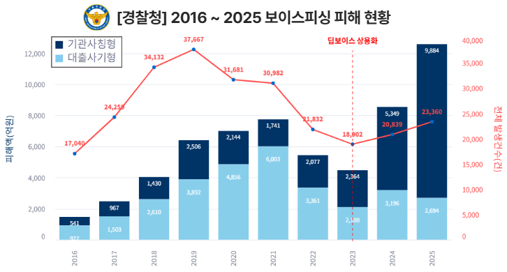

  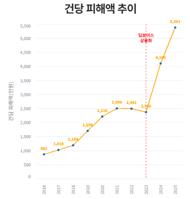
</div>

올해에는 단 7개월만에 작년 피해액을 돌파했고, 여기서 멈추지않고 10개월만에 피해액이 1조원을 돌파하며 화제가 되었다.<br>
- 올해에는 유독 통신사, 쿠팡 등의 개인정보 유출 문제가 크게 발생했었다.<br>
- 하지만 개인정보 유출 문제는 예전부터 지속적으로 발생하였고, 이에 따른 보이스피싱 피해 증가가 상관관계가 있다고 보기는 어렵다.<br>

피해 유형에는 `기관사칭형`, `대출빙자형`이 대표적인데, 최근 AI가 발전하면서 범죄 수법에도 AI를 활용하는 사례가 발생하고 있다.<br>
<br>

> **딥보이스**<br>
> 3초 분량의 목소리 샘플만 있어도 특정인의 말투, 문장 등을 구현할 수 있는 딥보이스 수법이 발전하며 피해가 증가하고 있다.

<br>

<div>
  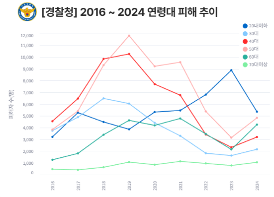

  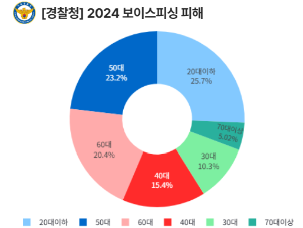
</div>

- COVID-19 시점부터 비대면 대출, 예적금이 유행되었으며 온라인 뱅킹에 익숙치 않은 중년층 이상의 연령대는 은행 창구에서 송금을 하려다 직원이나 주변인들의 신고로 현장에서 붙잡힌다.
- 그에 반해 온라인 뱅킹에 익숙한 젊은 층은 이러한 피해를 주변에서 막아줄 수 없는 상황에서 피해가 고스란히 발생하게 된다고 보여진다.

<div>
  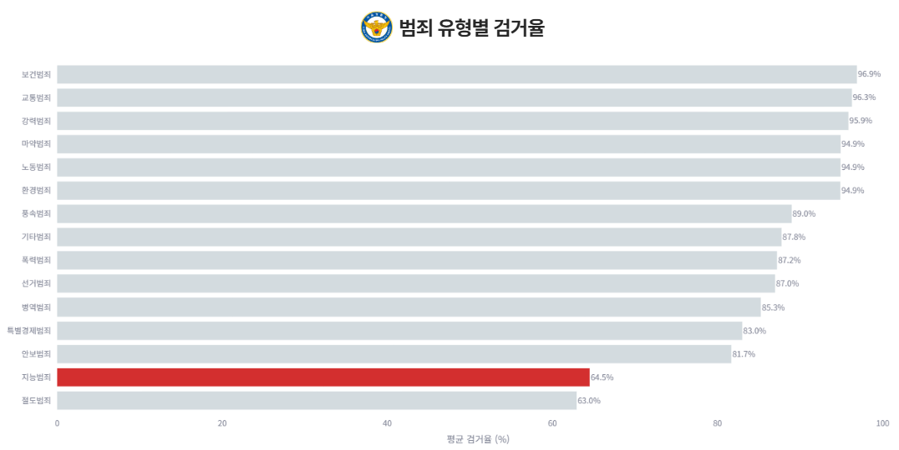
</div>

- 보이스피싱이 속한 지능형 범죄(사기)는 다른 유형의 범죄들에 비해 특히나 검거율이 낮다.
- 이렇듯 사기 범죄는 범인의 검거보다 사전 피해 예방이 가장 중요하다고 볼 수 있다.

본 프로젝트는 높은 보이스피싱/딥보이스 탐지 성공률을 통한 피해 감소를 목표로 한다.<br>
보이스피싱은 1건당 피해 금액이 **약 8,071만원**으로 계산된다. (영국 내무부 비용 모델 적용, 피해 금액 = 직접 피해액 + 사회적 비용 (직접 피해액의 1.5배))<br>
<br>
경찰의 검거는 사실상 피해금을 못돌려받는다고 봐야하지만, AI의 탐지로 인한 사전 차단은 피해액 전액을 보존할 수 있다.<br>
본 프로젝트는 이러한 범죄 조사 등의 사회적 비용 절감의 기대효과를 볼 수 있다.<br>

<br>

> **개발 기간** : 2025.12.22 ~ 2026.01.22 (31일)

> **개발 환경**<br>
> - Google Colab GPU A100<br>
> - Python 3.13<br>
> - Android Gradle Plugin (AGP): 8.13.2
> - Kotlin 2.0.21
> - Compile SDK: 35 (Android 15)
>     - Target SDK: 36 (Android 16 대응 설정)
>     - Minimum SDK: 33 (Android 13 이상 지원)
> - Java 버전: Java 11 (Compile/Kotlin JVM Target 모두)
> - UI 시스템: XML ViewBinding
> - Jetpack

<br>
<hr>

## 기존 유사 서비스와 차별점

| 서비스 | 탐지 중심 | 핵심 기술 | 신종 수법 | 개인정보 | 가중치 방식 | 판정 |
|:--:|:--:|:--:|:--:|:--:|:--:|:--:|
| `개발 앱` | 문맥 & 말투 | AE + koBERT | 방어 | 강력한 비식별화 | 의미 유사도 | 실시간 알림 |
| 익시오 | 키워드 | 온디바이스 AI | 취약 | 기기 내 처리 | 단순 포함 여부 | 실시간 알림 |
| 시티즌코난 | 악성 APK | 앱 시그니처 스캔 | 취약 | 기기 권한 대량 요구 | 없음 | 발견 즉시 |
| 에이닷 | 키워드 | 서버형 AI 분석 | 취약 | 서버 전송 분석 | 단순 포함 여부 | 실시간 알림 |
| 후후 | 발신자 번호 | 블랙리스트 DB | 취약 | 번호/스팸 정보 위주 | 없음 | 스팸/안심 |

<hr>

# 2. Restrictions (제약사항)
## 통신비밀보호법
- 대화 당사자 본인이 참여한 녹음은 상대방 동의가 없더라도 통신비밀보호법 위반이 아니다.
- 하지만 보이스피싱 탐지앱의 경우 녹음의 주체가 앱 이용자라고 하더라도 대화 내용을 서버로 전송해서 분석하는 구조라면, 앱을 운영하는 제3자가 타인간의 대화를 무단으로 녹음/청취하는 행위로 간주될 위험이 있기 때문에 온디바이스(On-Device) 형태로 우회하여 진행해야 한다.
- 실제 서비스되고 있는 후후, 익시오 등의 앱도 온디바이스 형태로 서비스되고 있다.

## 단말기 플랫폼 정책(Android/IOS)
- 예전에는 서드파티 앱이 통화 음성에 직접 접근할 수 있었다.
- 국가별 녹음 정책이 다르고 통화 프라이버시를 보장한다는 이유로 보안 패치 버전이 업데이트 되면서 서드파티 앱을 기본 통화앱으로 지정하더라도 통화 중에 상대방 음성에 직접 접근할 수 없다.
- 시스템 접근 권한이 없고, 인증된 서명 키가 없기 때문에 실제 통화 음성에 접근하여 완전한 실시간 탐지는 제한된다.
- 스피커폰 모드로 `주변 환경 음성 분석`으로 우회가 가능하나 이 경우에는 주변 잡읍/노이즈 이슈로 정확성이 매우 떨어진다.
- 보이스피싱 탐지의 과정은 모두 실시간으로 이루어져야 피해를 예방할 수 있기 때문에 단말기 `루팅`을 통해 서드파티 앱에 시스템 권한을 부여하고 기능을 구현하도록 했다.


<br/>
<br/>

# 3. Key Features (주요 기능)
- **포그라운드 서비스**:
  - 앱은 백그라운드에서 포그라운드 서비스를 이용해 동작하며, 사용자에게 실시간으로 알림 제공

<hr>
 
- **강력한 개인정보 비식별화**:
  - 대화 내용에서 본명, 주소, 전화번호, 계좌번호, 주민등록번호 등의 개인정보는 정규식을 사용하여 철저하게 마스킹 처리 후 개인정보 보호
  - 이를 통해, 모델이 특정 이름이나 주소 등에 의미를 부여하지 않도록 할 수 있음
 
<hr>

<div>
  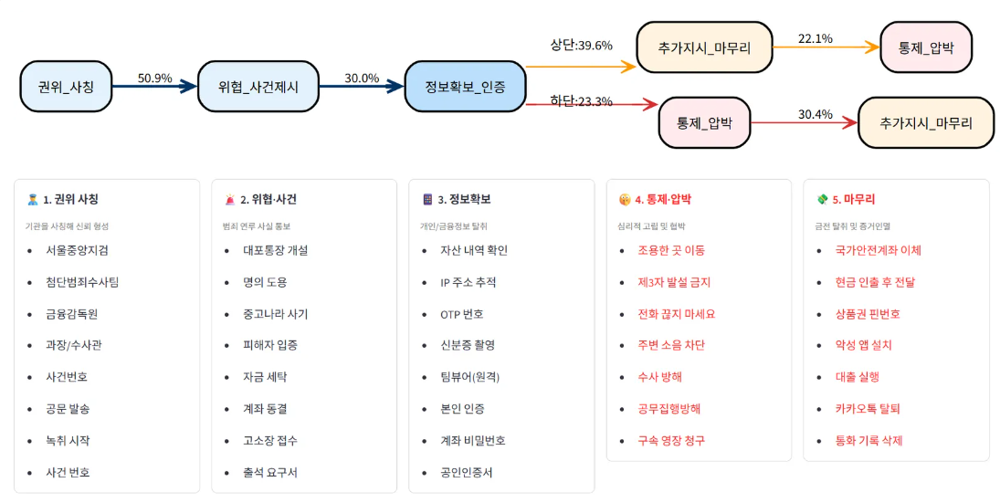

  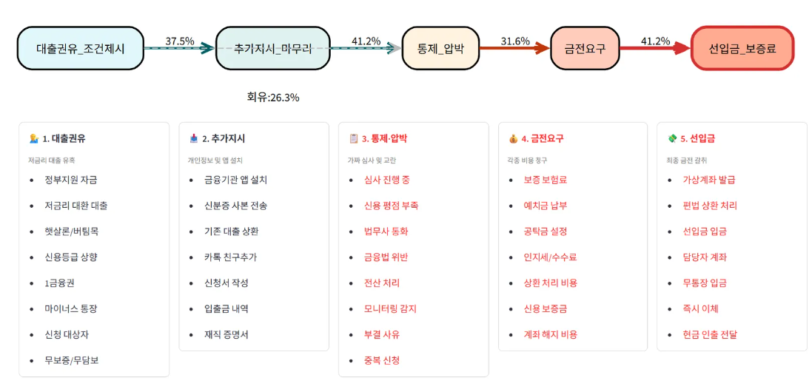
</div>

- **대화 맥락 탐지**:
  - 일상 대화 약 750만개를 사용하여 `AutoEncoder` 모델 구축 후 학습이 되지 않은 비정상 대화가 입력될 경우, 탐지된 시점부터 최근 3개의 대화 내용을 맥락으로 구성하여 `koBERT` 모델에 전송
    - 단일 모델로 구성했을 때보다 `AutoEncoder`로 1차적인 필터링 과정을 거치는 것이 성능 대폭 향상
      - 통화의 대다수를 차지하는 일상적인 대화는 `AutoEncoder`가 처리하므로 연산량/서버 비용 대폭 감소
      - 사용자 경험 개선
      - 신종 수법이 등장하더라도, `AutoEncoder`가 복원 오차를 크게 발생시키므로 즉각적으로 대응 가능
      - 두 모델이 다른 관점으로 분석하기 때문에 단순 키워드 등장뿐만 아니라 문맥적 이상함까지 탐지해야 피싱으로 판정
      - 단순히 키워드 업데이트만으로도 신종 수법 즉각 차단 가능
      - 가벼운 `AutoEncoder` 모델을 재학습으로 정상 대화의 범주 확장
    - 보이스피싱에 주로 사용되는 피싱 키워드를 추출하고, 가중치 패널티 부여
    - 오탐 감소를 위한 세이프 키워드 배열을 구축하고, 가중치 부여
  - 한국어 사전 학습된 모델 `koBERT` 에 금융/상담 데이터와 실제 보이스피싱 대화 데이터를 사용하여 파인 튜닝을 진행하고, 대화 맥락 정밀 분석 진행(이진 분류)
  - 분석이 진행될 때마다 위험 스코어를 계산하고 누적이 되어 임계치를 초과할 경우 보이스피싱이라고 판단하여 실시간 경고 알림 전송
 
<hr>

<div>
  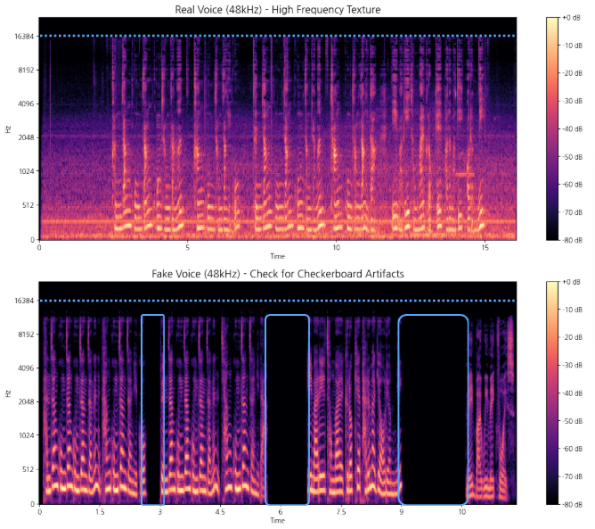

  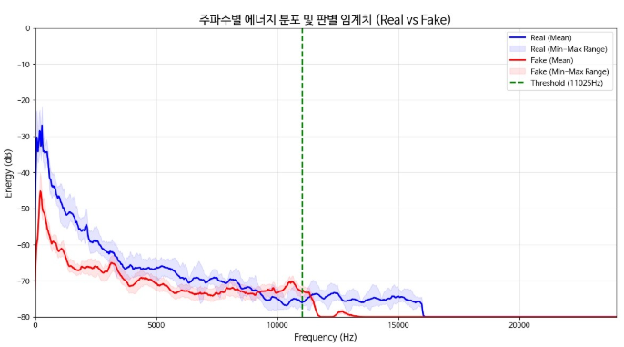
</div>

- **딥보이스 탐지**:
  - 음성에서 `Mel-Spectogram`, `MFCC` 2가지 기법을 활용하여 음성의 특징을 추출하여 2개의 `Res2Net50-SE` 모델 구축 후 이진 분류
    - `Res2Net50-SE`는 하나의 레이어를 여러 데이터 그룹으로 나누어 계층적으로 연결하여 다양한 특징을 추출할 수 있음
    - 50계층의 깊은 네트워크를 통해 풍부한 학습을 진행할 수 있음
    - `SE Block`을 통해 추출한 특징 전체의 정보를 압축하고, 모델이 스스로 변조 채널에만 집중할 수 있도록 함(판정에 의미가 없는 무의미한 채널은 스스로 억제)
  - 정상 데이터는 `AI-Hub`의 한국인 대화 음성 데이터, 다화자 음성 데이터, `ASVspoof2024_bonafide`를 사용하고, 비정상 데이터는 `ASVSpoof2024_spoof`와 정상 데이터를 `RVC` 변환한 데이터를 사용
  - 변조된 음성은 주로 고주파 대역에서 변조 흔적이 발견됨(변조 과정 중 고주파 대역 손실)
  - 변조된 음성은 무음 구간에서 "완전한 무음" 상태가 됨(실제 음성은 숨소리, 환경 노이즈, 공기의 떨림 등의 아주 미세한 음성이 들어있음)
  - 실시간 탐지에 중점을 두기 때문에 `5초` 분량의 음성을 듣고 이상 유무를 판단하도록 `5초 구간 내의 특징 추출`, `패딩 처리`, `랜덤 가우시안 노이즈 증강`, `랜덤 볼륨 조절`의 전처리 후 모델 학습에 사용
  - `DF(Deep Fake)` : 100가지 이상의 다양한 딥페이크 생성 기법
  - `PA(Physical Access)` : 실제 녹음된 음성을 재생하는 기법
  - `LA(Logical Access)` : 음성 합성 및 변환 알고리즘을 사용한 기법
  - 위 3가지 기법을 모두 비정상 데이터로 분류
  - 최종적으로 딥보이스 탐지에는 총 2개의 분류기를 사용하며, 각 예측값을 입력으로 받는 `로지스틱 회귀 모델`을 두어 `스태킹 앙상블` 기법을 통해 최종 결과 산출

- **감성 분류**:
  - `w11wo/wav2vec2-xls-r-300m-korean` 사전 학습 모델에 파인 튜닝 진행
  - 감성 및 발화 스타일별 음성 합성 데이터(AI-Hub) : 7가지 감성("Angry", "Anxious", "Embarrassed", "Neutrality", "Happy", "Sad", "Hurt")
  - 일반적인 감정 인식(행복, 슬픔 등)을 분류하는 것이 목표가 아니라, "이 통화가 보이스피싱인가?"를 판별하는 것이므로 피싱범이 사용하는 `공격성`, `긴박함`, `권위적인 태도` 등을 모두 압박(1)이라는 하나의 위험 신호로 간주하여 탐지 효율을 높이는 것에 중점을 둠
  - 각각 세부 감정으로 나누지 않고, 2개의 클래스로 묶어 모델이 학습해야 할 경계선을 명확하게 만듦
  - 즉, 복잡한 감정 분석보다는 보이스피싱 특유의 위협적인 패턴을 놓치지 않고 잡아내는 것에 집중하기 위해 이진 분류 선택

<div>
  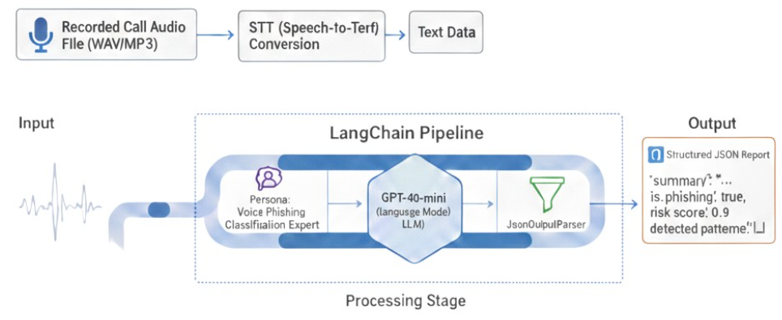
</div>

- **통화 요약 리포트**:
  - `LangChain` 과 `GPT-4o-mini` 모델을 사용해 통화 내용 요약 리포트를 작성
  - `GPT-4o-mini` : 비용 효율성과 처리 속도가 매우 뛰어난 모델로, 실시간 분석이 필요한 시스템에 적합
  - `temperature = 0` : 모델의 무작위성을 제거하여, 동일한 내용에 대해 항상 일관된 분류 결과를 도출
  - `Persona` : 모델에게 보이스피싱 분류 전문가 페르소나를 부여하여 분석의 정확도 향상뿐만 아니라 위험 요소를 분류할 수 있도록 함
  - `Json Output Parser` : LLM의 응답을 Json 형태로 바로 받아서 추후 DB 저장/UI 출력에 용이하도록 설정
  - `LCEL` : LangChain의 최신 문법으로, 데이터의 흐름을 직관적으로 연결(프롬프트 입력 → 모델 처리 → 결과 파싱 순서로 진행)

<div>
  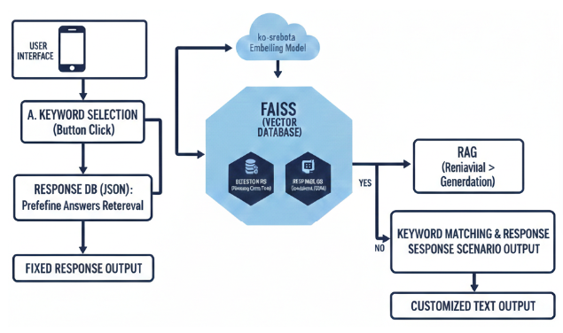
</div>
 
- **챗봇**:
  - `LangChain` 프레임워크와 `jhgan/ko-sroberta-multitask` LLM 모델 사용
  - 실제 보이스 피싱 대화를 임베딩하여 구축된 `VectorDB(FAISS)` 적재
  - 통화 리포트 내용을 기반으로 주요 키워드를 추출하여 `Chip` 제공
  - `RAG` 기법을 사용하여 사용자의 질문과 관련된 유사한 통화 내역을 찾아 답변 제공(최대 5초 내로 답변 제공, 대기 중에 로딩바 출력)
  - 질문과 유사한 통화 내역이 없을 경우, 관련된 사례가 없다는 답변 출력하게 하여 LLM의 환각 문제 억제
 
- **FastAPI**:
  - 실시간 탐지를 위해서는 전체적인 파이프라인이 `5초` 내에 최종 결과를 산출할 수 있어야 함
  - 사용자는 어떤 기술 스택을 사용하는지 전혀 신경쓰지 않으며, 응답 속도가 조금이라도 느려지면 바로 이탈할 가능성이 높음
  - 단말기 스펙에 따라서 탐지하는 데에 시간이 딜레이 될 가능성이 존재하기에 전체 파이프라인은 서버에서 동작하도록 구현
  - 비동기를 지원하며 파이썬으로 서버를 구축하는 프레임워크 3가지 중 가장 속도가 빠름

<div>
  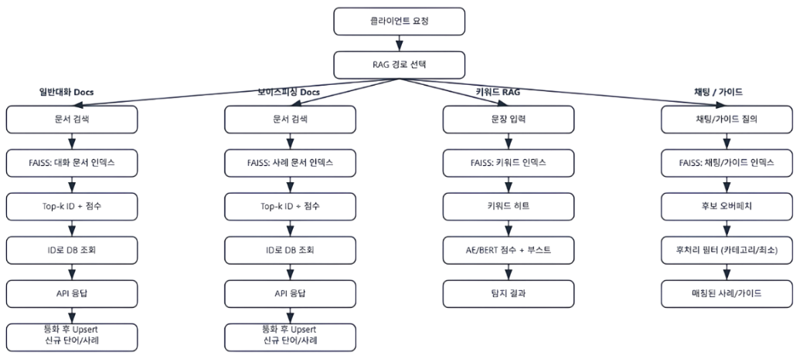
</div>
 
- **사후 관리**:
  - `FastAPI`와 가장 좋은 퍼포먼스를 보여주는 RDBMS인 `PostgreSQL` 사용하여 피싱 키워드, 세이프 키워드, 신고 내역 등을 저장
  - `AutoEncoder`와 `koBERT` 파이프라인으로 구성된 대화 맥락 탐지 기법은 신종 시나리오가 등장하더라도, `AutoEncoder` 단계에서 복원 오차를 높게 발생시켜 방어막 역할을 수행 가능
  - 정상 대화만 추가시켜 가벼운 `AutoEncoder` 모델만 재학습시켜 정상 범주를 크게 확장시킬 수 있음
  - 새로운 사기 수법 포착 시, 관련 키워드를 DB 키워드 배열에 즉시 추가하여 즉각적으로 차단 시작
  - 해당 키워드로 걸러진 대화 내용들을 따로 분류하여 학습용 데이터셋으로 구축
  - 지속적으로 데이터를 축적하고 일정 기간마다 또는 데이터가 충분히 쌓였을 때, 모델을 재학습시켜 새로운 사기 수법 학습
  - 모델이 너무 똑똑해지면, 너무 광범위했던 키워드 가중치를 감소시켜 오탐 감소
  - ~전기통신금융사기 통합대응단 크롤링을 통해 사전 데이터베이스 구축~
    - 01000000000 ~ 01099999999 범위의 크롤링은 총 1억번의 크롤링을 진행해야 함
    - 공공기관을 대상으로 한 과도한 크롤링은 트래픽 공격 이슈와 법적 문제 초래 이슈로 진행 X
    - 우회) 시연을 위한 임시 번호로 데이터 베이스 구축
  - 보이스피싱과 관련된 정보를 저장하여 반복적인 피해를 방지하도록 구현


<br/>
<br/>

# 4. TEAM Tasks & Responsibilities (팀원 소개 및 역할 분담)
|  |  |  |
|-----------------|-----------------|-----------------|
| 허성욱<br>[GitHub](https://github.com/dokpe01) | `팀장` | <ul><li> 프로젝트 총괄 및 일정 관리 </li> <li> 전체 파이프라인 설계 </li> <li> 대화 맥락 탐지 모델 개발 <li> 딥보이스 탐지 모델 개발 </li> <li> 감성 분류 모델 개발 </li> <li> 전체적인 모델 성능 개선 </li> <li> 프로젝트 발표 </li> </ul> |
| 이경민<br>[GitHub](https://github.com/bidulgirin) | `팀원` | <ul><li> 애플리케이션 개발 <li> 데이터베이스 설계 및 구축 </li> <li> FastAPI 서버 구축 및 배포 </li> <li> 유지보수 자동화 파이프라인 구축 </li> </ul> |
| 김나영<br> [GitHub](https://github.com/NA-young524) | `팀원` | <ul><li> 통화 요약 리포트 모델 개발 </li><li> 챗봇 개발 </li> <li> 딥보이스 탐지 모델 개발 </li> <li> 음성 신호 분석 </li> </ul> |
| 김정안<br>[GitHub](https://github.com/jeongan47) | `팀원` | <ul><li> 피해 현황 데이터 수집 및 분석 </li><li> 대시보드 개발 및 시각화 </li> <li> 피싱 데이터 수집 및 대화 맥락 분석 </li> </ul> |

<br/>
<br/>

# 5. Technology Stack (사용 기술)
|  |  |
|-----------------|-----------------| 
| FastAPI | API 서버 구축 |
| PostgreSQL | 데이터베이스 구축 |
| Android Studio | 애플리케이션 개발 | 
| Pytorch | 모델링 및 pth 형태로 저장 후 백엔드 연동 |
| Tensorflow | RandomForest 모델 구축하여 스태킹 앙상블 시스템 구축 |
| Whisper | Faster-Whisper Large V3 모델로 STT 변환 진행 |
| koBERT | HuggingFace 한국어 사전 학습 모델 로드 후 문맥 기반의 파인 튜닝을 통한 대화 맥락 정밀 분석 |
| Transformer | Self-Attention, Multi-Head 기술로 전체적인 맥락(흐름)을 분석 |
| AutoEncoder | koBERT의 서버 비용 및 연산량 대폭 감소를 위한 1차적인 방어막 역할 수행 |
| MFCC | 음성 신호의 특징을 수치화한 벡터 |
| Mel-Spectrogram | 음성 신호의 특징을 그림으로 표현 |
| LangChain | 통화 요약 리포트 및 챗봇 프레임워크 |
| RAG | 외부 문서 검색 증강 기법 |
| AI Agent | LLM 모델에 페르소나를 부여하여 분석 정밀도 향상 |
| VectorDB(FAISS) | 사례를 임베딩하여 챗봇에서 검색할 수 있는 문서 구축 |
| Wav2Vec 2.0 | 감성 분류 사전 학습 모델 |
| BS4 / Selenium | 금융감독원 보이스피싱 사례 동적 크롤링 |
| Git / GitHub | 코드 관리 |
| Google Sheet | WBS 등 공동 문서 작업 및 데이터 관리 |
| Streamlit | 데이터 분석 보고서 대시보드 작성 |


<br/>
<br/>

# 6. Project Structure (프로젝트 구조)
```plaintext
project/
├── BackEnd/
├── FrontEnd/
├── Model/
├── Screenshot/
└── ipynb/
```

<br/>
<br/>

# 7. App Features (앱 기능)

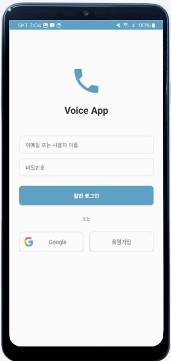

- 로그인 화면

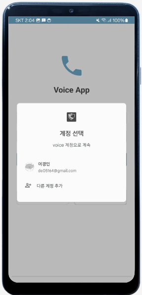

- 구글 로그인 지원

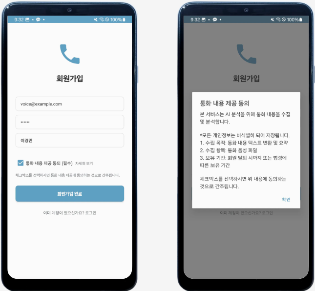

- 회원가입 시, 사용자에게 통화 내용 제공 동의를 받는다.
- 해당 통화 내용은 개인정보가 전부 비식별화된 텍스트로 모델 재학습에 사용된다.

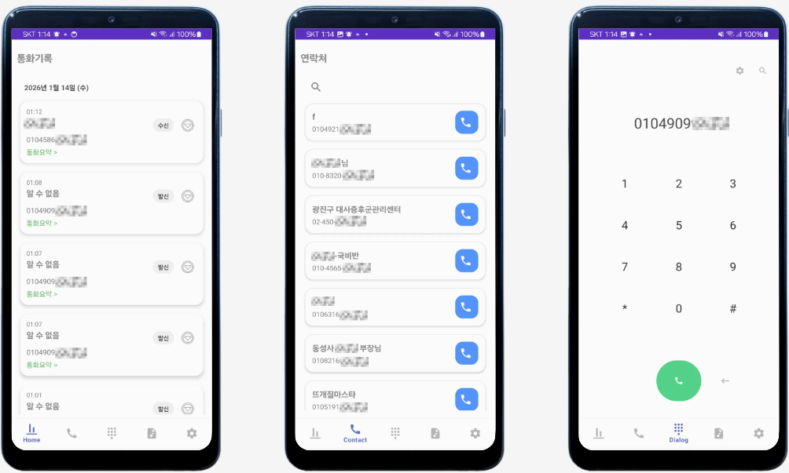

- 통화내역, 연락처, 다이얼

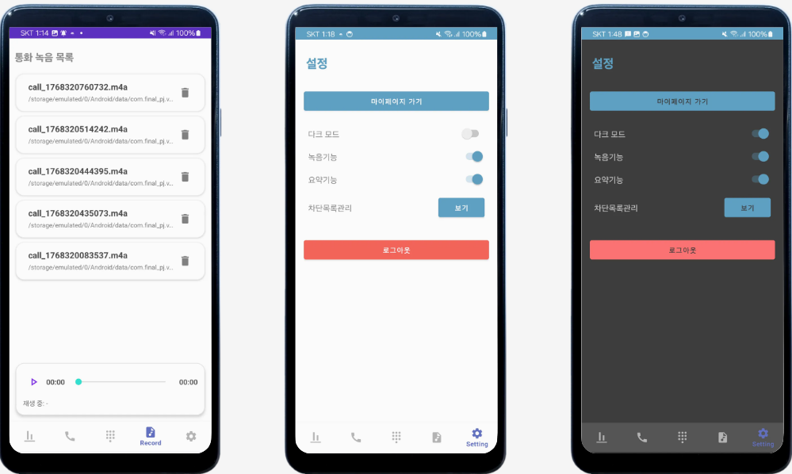

- 설정 탭에서는 기본적인 설정 기능들을 제공한다.

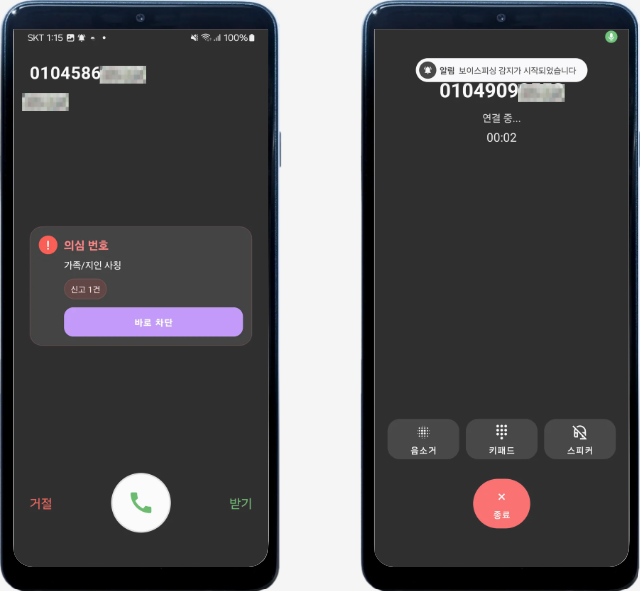

- 통화 걸려오면 발신자의 전화번호가 신고된 내역이 있는지 확인한다.
- 신고된 내역이 있다면 팝업으로 해당 내용을 사용자에게 알려준다.
- 통화가 시작되면 통화 내용 분석을 위한 녹음이 시작된다는 알림을 보낸다.

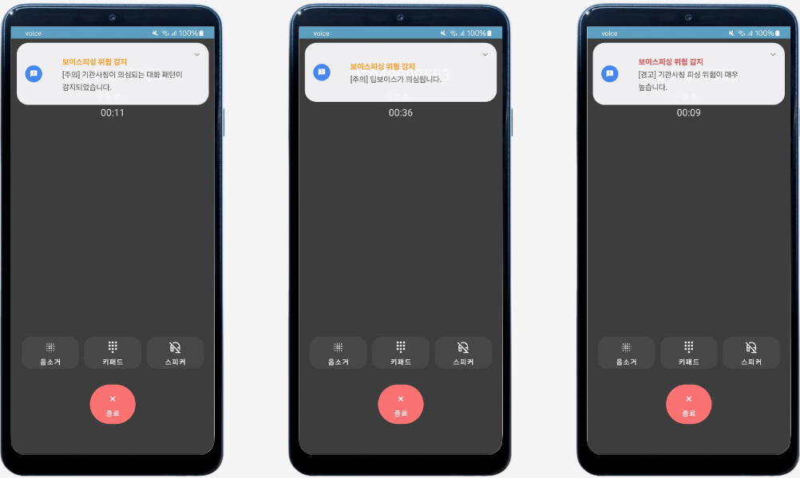

- 5초 단위로 딥보이스/보이스피싱 위험이 감지되면 사용자에게 진동 피드백과 함께 알림을 보낸다.

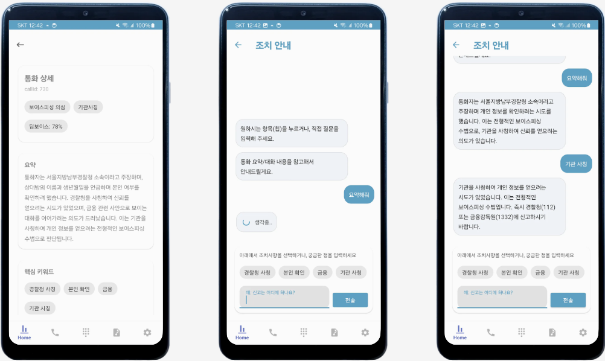

- 통화가 종료되면 해당 통화 내용에 대한 요약 리포트가 작성된다. (약 3초 정도 소요)
- 리포트를 통해 챗봇을 사용할 수 있다.

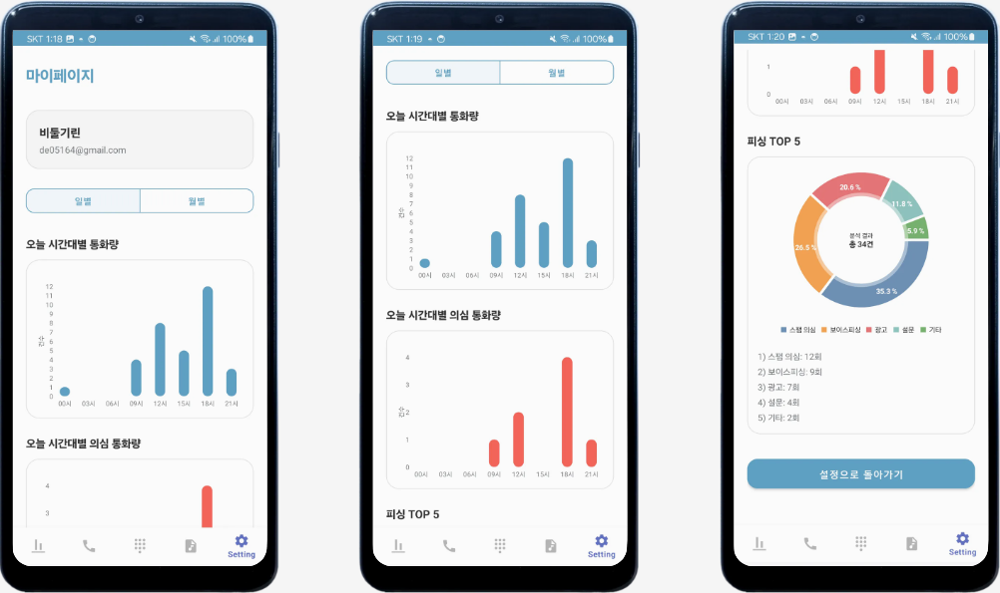

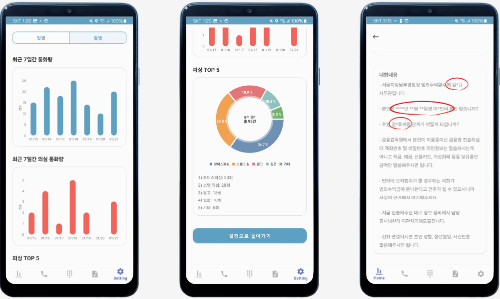

- 마이페이지에서는 사용자에게 걸려온 전화 중 피싱 위험이 있는 건이 얼마나 되는 지, 어떤 유형별인지 그래프로 보여준다. (일간/월간)

<br/>
<br/>
